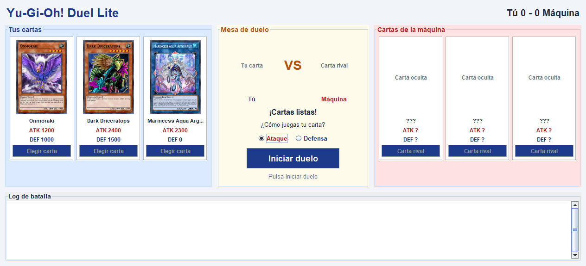
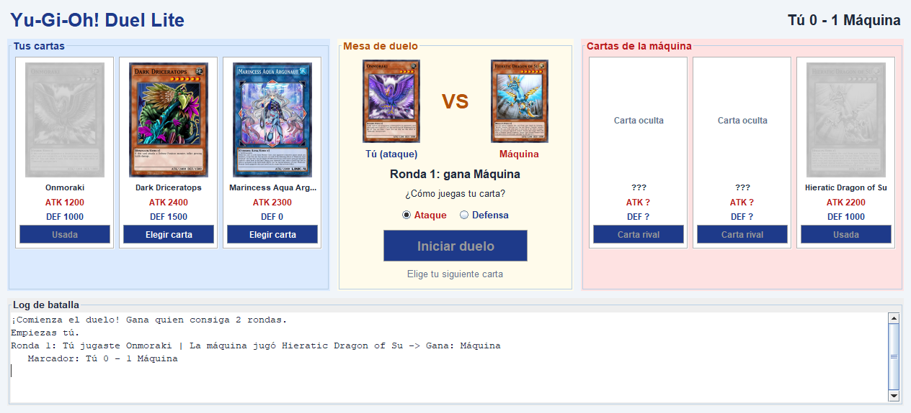
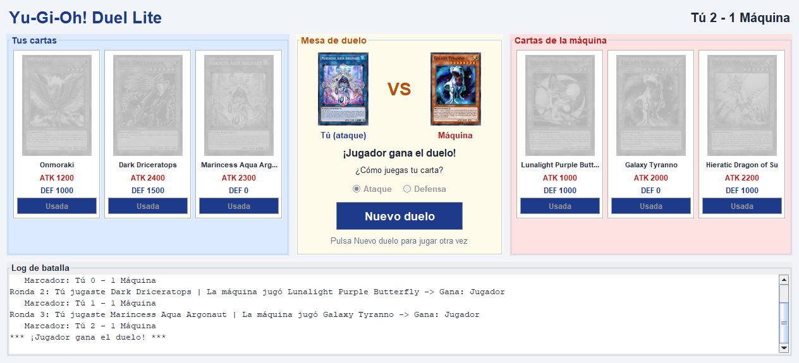

# Yu-Gi-Oh! Duel Lite

Laboratorio #1 - Desarrollo de Software III
Tecnología en Sistemas - Universidad del Valle
Docente: Mg(c). Juan Pablo Pinillos Reina

## Integrantes

| Nombre | Parte |
|---|---|
| Juan Sebastian Falla | Interfaz gráfica (diseño con GUI Designer) |
| Jessica Viviana Viscue | Lógica del duelo y consumo de la API |

## Descripción

Mini-aplicación de escritorio en Java Swing que simula un duelo sencillo de Yu-Gi-Oh! entre un jugador y la máquina. Cada jugador recibe 3 cartas Monster obtenidas en vivo desde la API [YGOProDeck](https://db.ygoprodeck.com/api/v7/randomcard.php), con su imagen, nombre, ATK y DEF. En cada ronda el jugador elige una carta y su posición (ataque o defensa), la máquina elige una al azar y gana la carta con mejores stats. El primero en ganar 2 de 3 rondas gana el duelo.

## Requisitos

- Java 17 o superior
- IntelliJ IDEA con el plugin **Swing UI Designer** (para abrir y editar los archivos `.form`)
- Conexión a internet (para pedir las cartas y sus imágenes a la API)

## Instrucciones de ejecución

**Desde IntelliJ IDEA**

1. Abrir la carpeta del proyecto (`File > Open`) y esperar a que Gradle descargue las dependencias.
2. Abrir `src/main/java/yugioh/Main.java`.
3. Presionar el botón verde de **Run** junto al método `main`.

**Desde la terminal**

```bash
./gradlew run
```

En Windows:

```bash
gradlew.bat run
```

**Cómo jugar**

1. Al abrir la ventana se cargan las 3 cartas de cada jugador. Las de la máquina quedan ocultas.
2. Cuando las 6 cartas están listas, presionar **Iniciar duelo**.
3. Elegir la posición (**Ataque** o **Defensa**) y presionar **Elegir carta** en una de tus cartas.
4. La máquina revela su carta, se muestra el ganador de la ronda y el marcador se actualiza.
5. Gana quien consiga 2 rondas. Con **Nuevo duelo** se reparten cartas nuevas.

## Estructura del proyecto

```
src/main/java/yugioh
├── Main.java                  Punto de entrada: crea la ventana y conecta la lógica
├── api
│   └── YgoApiClient.java      Pide cartas Monster a la API y las convierte en Card
├── duelo
│   ├── BattleListener.java    Eventos del duelo: onTurn, onScoreChanged, onDuelEnded
│   ├── Duel.java              Reglas del duelo: turno inicial, comparación ATK/DEF y puntaje
│   └── ControladorDuelo.java  Une la API, las reglas y la ventana (carga en segundo plano)
├── interfaz
│   ├── VentanaDuelo.form      Diseño de la ventana principal
│   ├── VentanaDuelo.java      Comportamiento de la ventana (implementa BattleListener)
│   ├── PanelCarta.form        Diseño de una carta (se usa 6 veces)
│   ├── PanelCarta.java        Comportamiento de una carta
│   └── AccionesDuelo.java     Acciones del usuario que la ventana le pasa a la lógica
└── modelo
    └── Card.java              Datos de una carta: nombre, ATK, DEF e imagen
```

## Diseño

El proyecto separa la interfaz de la lógica. La interfaz está hecha con el GUI Designer de IntelliJ: `VentanaDuelo.form` organiza la pantalla en tres zonas (tus cartas en azul, la mesa de duelo en el centro y las cartas de la máquina en rojo) más el log de batalla desplazable (`JTextArea` dentro de un `JScrollPane`). Cada carta es una copia de `PanelCarta.form`, así que el diseño de una carta se edita en un solo lugar. Los botones **Iniciar duelo** y **Elegir carta** usan `ActionListener`, y las imágenes se descargan con `SwingWorker` para no bloquear el hilo de la interfaz.

La comunicación entre las dos partes se hace con interfaces. Cuando el usuario hace clic, la ventana avisa a la lógica por medio de `AccionesDuelo` (repartir cartas, iniciar duelo, carta elegida). Cuando la lógica resuelve una ronda, avisa a la ventana por medio de `BattleListener` (`onTurn`, `onScoreChanged` y `onDuelEnded`). Así la lógica no conoce los componentes de Swing y la ventana no conoce las reglas del duelo.

## Capturas de pantalla

**Cartas listas para iniciar el duelo**



**Resultado de una ronda**



**Fin del duelo**

